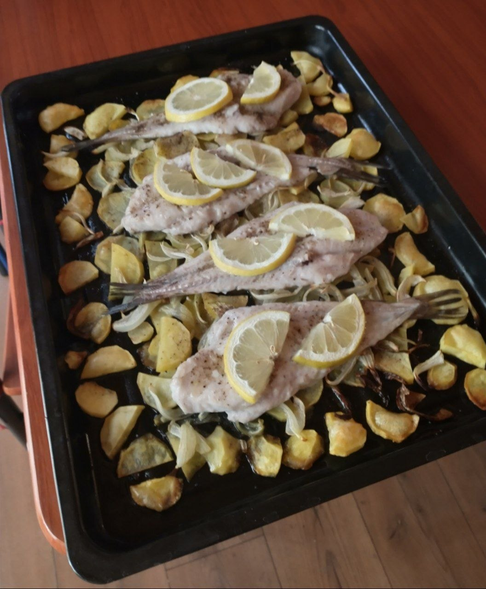

De vez en cuando me meto a revisar el blog de caldostrong, uno de los blogs que me inspiró a hacer el mío. Una sección a la que no presté mucha atención en su momento fue la de "cocinando con caldo" y, luego de leer algunas de sus publicaciones, encontré que sería interesante tener mi propia sección culinaria.

## Sobre mi alimentación

Últimamente, como parte de la operación six-pack de este año, me he puesto a comer proteína como loco.

Como me gusta planificar mis gastos y consumir inteligentemente, me puse a jugar en una hoja de cálculo con los distintos rendimientos proteína/precio de las fuentes más conocidas de este nutriente. Mientras caminaba en la feria el sábado pasado, pasé al lado del carrito de pescados y me pregunté: "¿cuánto rendirán los pescados de la feria en términos de proteína?". Luego de consultar los precios y hacer unos cálculos, me di cuenta de que es una gran alternativa, por lo que me puse a buscar alguna receta no tan calórica como la frita para preparar una merluza, y ver qué tal iba.

## El plan

Encontré una receta al horno que se veía bastante buena, y me puse manos a la obra. Me hubiese gustado encontrar una que preparara solo el pescado en el horno, pero todas las que pillé dejan una base antes de meter el pescado, supongo que debido a que su cocción es lenta y delicada, y si se pega al latón podría quedar como la mierda.

La receta que seguí fue [esta](https://www.youtube.com/watch?v=rjofAbF4rlo) (está bastante simple, recomendada), y este fue el resultado:

¿Cómo me quedó? Espectacularsh, primera vez que una receta queda tan pero tan buena la primera vez que la hago, no sé si la merluza estaba particularmente fresca, o tuve cuea con alguna otra wea, pero quedó realmente exquisito, y lo mejor es que no le eché tanto aceite tampoco, por lo que como plato rico/sano/no tan caro quedó bastante alto en mi lista.

3700 me salieron los 4 filetes de merluza, nada mal, yo creo que en precio está por ahí con el pollo, que debe ser de lo más competitivo en términos de proteína/precio/sabrosura.

Y eso, 10/10, las papas también quedaron muy buenas, y mi hermano, que tiene un paladar más crítico que el mío, también encontró que quedó muy bueno, más no se puede pedir.
