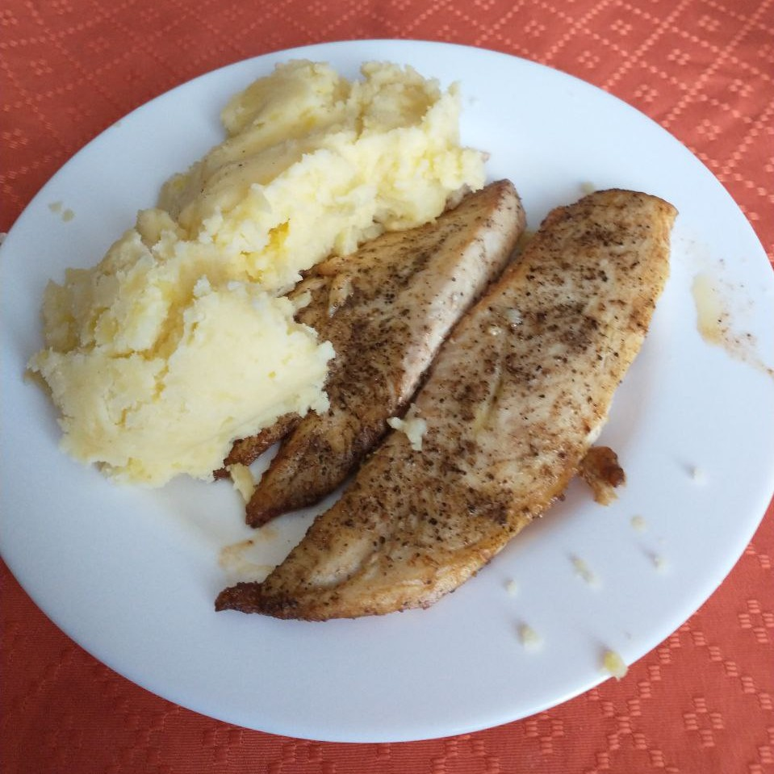

Bueno, salió tan bien la merluza al horno que me animé a probar otro plato, esta vez de reineta a la mantequilla. La receta la saqué de un video de YouTube bastante cutre, pero cuya duración era suficientemente corta como para verlo completo sin que mi descompuesto cerebro se saltara una parte.

Compré reineta porque no soy Bill Gates y mi incursión en el mundo de los pescados no puede ir mucho más allá de las 4 lucas el kilo. Considerando que todo esto lo empecé a hacer en búsqueda de proteína barata, la cantidad de pescado que se pierde después de sacarle la espina, la cabeza y todo eso es considerable. 5 lucas me salió la reineta, 4 lucas salía el kilo, y luego de la mutilación, quedaron 350 gramos de filete. Re poco en verdad, anda por ahí con un corte de vacuno que hasta diría puede llegar a aportar más proteína, pero bueno, se pasó bien.

## El resultado

Muy weno, realmente muy weno. No sé si soy un crack haciendo estos platos, son a prueba de bobos, o tuve mucha cuea, pero el de la semana pasada y este me quedaron 10/10.

La verdad no sé qué más comentar, el puré con leche y mantequilla nunca falla tampoco, y nuevamente el plato recibió una buena review de mi hermano.

Aquí les dejo una fotito de cómo quedó:

