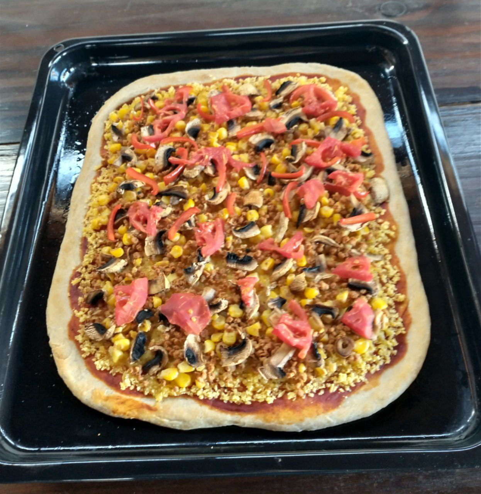

El viernes pasado le hicimos algo muy piola al Blaz por su cumpleaños, y decidí aportar con una pizza vegana. Y aunque el Blaz es vegetariano, el Jero es vegano, y como se puso con el queso, lo aproveché de usar para la pizza entera.

La masa la hice el día anterior junto a mi hermano, aprovechando que tiene más experiencia con la receta, y que estaba haciendo su propia pizza para celebrar el 14 de febrero. 

Los ingredientes fueron:

**Para la masa**
- Harina
- Sal
- Levadura
- Aceite de oliva
- Agua

**Para la cobertura**
- Queso vegano
- Carne de soya
- Pimentón
- Tomate
- Choclo
- Champiñón
- Salsa de tomate

¿En qué proporciones y de qué forma? Me dio paja escribirlo, pero el resultado se vio así:

Quedó muy buena, al menos como a mí me gusta, esponjosa, no crocante. Tal vez el queso no se derritió bien, pero creo que así es el queso vegano, nada que hacer.
