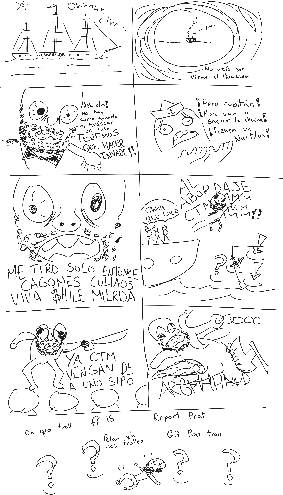

Hay tallas que uno no olvida, y una de mis favoritas ocurrió cuando, al tiempo que jugaba LoL con unos amigos, hablábamos de historia, y salió el tema de que Carlos Condell es mucho menos recordado que Arturo Prat, a pesar de que Condell fue el que carrió el Combate Naval de Iquique. La talla fue que Condell no es recordado porque no estuvo en el invade. Debido al contexto (justo estaba empezando la partida), fue muy chistoso en su momento, aunque creo que es imposible transmitirlo en este blog.

Como una de las ideas de este blog es explorar distintas facetas del arte, y no tengo un talento particular dibujando, decidí dibujar un cómic, que como mínimo no requiere ser tan bueno, siempre y cuando conceptualmente tenga gracia. Disfruten.

