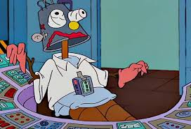
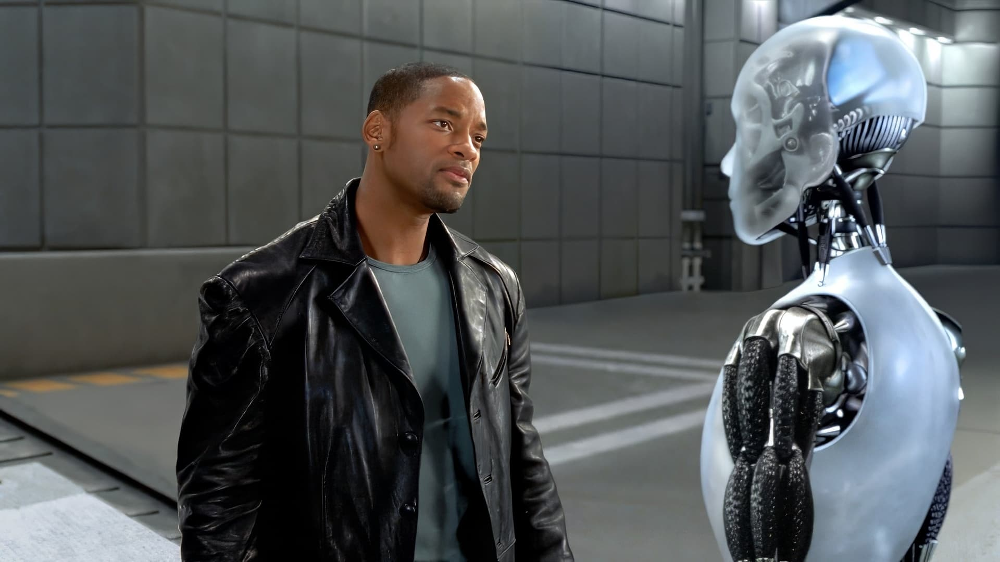

Ha llegado, existe, está aquí. DarIAdius está listo para reemplazar al saco de carne que, hasta ahora, ha llevado a duras penas este blog. Daridius tiene los días contados, y es su misma creación quien pondrá el último clavo en su tumba.

DarIAdius es una inteligencia artificial, es de código abierto. Este es su código:

```javascript
if(pregunta)
    return chatgpt("escribeme una talla fome").response
```

El último desafío que deberá superar DarIAdius será vencer a Daridius. Estuve mucho rato pensando sobre en qué campo tendría que vencerme, pero no se me ocurrió nada divertido. Vamos con el blog.

## Desde Frankenstein hasta Terminator

El arquetipo de "creación vs creador" debe ser uno de los más utilizados en la literatura, y lo que antes era la traición de un hijo, con la llegada de la tecnología tal y como la conocemos fue apareciendo la idea de que las propias máquinas, una vez dotadas de conciencia, se alzarían contra nosotros. No le tengo miedo a DarIAdius, estoy preparado para enfrentarme a él.

<div class="image-medium">



</div>
<span class="image-caption">Foto de DarIAdius</span>

## La diferencia

El otro día estuve pensando por mucho rato sobre, si se llegan a dar ciertas condiciones, cómo tendríamos que diferenciar a un robot de un ser humano. Hoy en día la diferencia es clara, pero el salto cognitivo que han dado es gigantesco. Mucha gente dice que estas máquinas solo son una calculadora gigante de probabilidades, que no piensan, y que jamás podrán crear algo por ellas mismas.

A esta afirmación nace de forma natural la pregunta: ¿y qué somos nosotros? Cuando en *Yo, Robot* (la peli), Will Smith le dice al robot (no me acuerdo cómo se llama, le diremos Pepe) que él no puede escribir un poema, o dibujar un cuadro hermoso, este le pregunta "¿Tú sí?". Me parece una respuesta genial por parte de Pepe. Y es que hasta los más talentosos de los artistas, científicos o guerreros, han aprendido, de algo o de alguien, pero entrenan con la información que devora nuestro cuerpo día a día, como un monstruo insaciable. Nos gusta ver, sentir, oler, sufrir, llorar, no hay tiempo que perder, cada segundo que pasa nuestro cerebro utiliza los estímulos que recibe del mundo exterior y aprende de ellos, entrena y entrena con miles de millones de datos. Similar a un datacenter pero con un consumo moderado de agua, suelen decir que con 2 litros diarios es suficiente.

<div class="image-medium">



</div>
<span class="image-caption">Pepe y Will Smith</span>

## Lo que nos diferencia

A veces creo en Dios y a veces no, pero siempre he sido cristiano. En todo caso, por conveniencia, le vamos a dar una patada a la religión, ya que para esta discusión, el marco teórico secular plantea un problema mucho más interesante. ¿Tiene algo de especial nuestro cerebro? ¿Se salta la ley de Ohm? ¿Desafía las leyes de la materia? Tal parece que no. Y entonces, ¿qué lo diferencia de una máquina? ¿Qué nos priva de crear algo similar? Me atrevería a decir que nada.

## Patrones

Pensando en cómo se podría crear un cerebro humano, me quemé un poco la cabeza. Por mucho rato pensé en cómo se podría copiar uno, pero luego me di cuenta de que, en cómo la vida misma trabaja la información, está el secreto para lograr algo como esto.

Muchas veces nos obsesionamos con definir las cosas. Qué medidas exactas, qué definiciones precisas. Pero en nuestro cerebro, al final del día, la forma en que guardamos la información parece asemejarse mucho más a cómo estos modelos de IA describen las cosas, con pequeños vectores (a veces de miles de millones de datos, pero siempre mucho más pequeños en relación a lo que describen) que a la información exacta que nos provee la realidad en todo momento.

Como reflexioné en el [post de la compresión extrema de imágenes](/blog/2026/02/06/compresion-extrema-de-imagenes), nadie es capaz de recordar una imagen tal y como la observa. Solo recordamos patrones que simplifican aquello que vimos: "acá había un árbol", "allá un auto". Y aunque podemos aumentar la precisión de la descripción, con un "el auto era azul, esta era su patente, y esta su gama de sombras", nunca dejará de ser una descripción, porque así funciona la máquina, así funcionamos nosotros.

Nadie nace adulto. ¿Cómo un ser humano puede dar a luz a otro? Soy el resultado de mi ADN y de cómo este fue evolucionando en base a su entrenamiento. En mi ADN están todas las instrucciones para crear un cerebro humano. ¿Del mismo ADN siempre saldrá el mismo cerebro? Obviamente no, el resultado varía según las condiciones en las cuales se "descomprimió" el ADN. Tal como nano banana toma un vector y a partir de él crea una imagen, el mundo tomó mi ADN y a partir de él crea una persona.

## La IA y la vida

Es fácil concordar que antes de resolver si un robot puede llegar a ser un humano debemos resolver si puede siquiera llegar a tener vida. Esta discusión sí que es heavymetalera.

Todo son patrones, nada existe realmente como tal. No hay una definición fija de qué es, por ejemplo, un perro. Todo aquello que llamamos perro es distinto uno del otro. Y a pesar de no ser iguales, los categorizamos según patrones que relacionan aquellos seres que comparten más de lo común.

Para llegar al tema de la IA como vida creo que hay varias formas de abordarlo. Si reemplazo una neurona por un transistor, ¿sigo siendo humano? ¿Y si reemplazo 2? Es interesante cómo el [barco de Teseo](https://es.wikipedia.org/wiki/Paradoja_de_Teseo) puede explotar cualquier consenso. ¿Soy humano porque correspondo al patrón de un humano? ¿Cuando dejo de responder a ese patrón, dejo de ser humano? ¿Dónde está la línea? ¿Cuándo dejo de ser humano?

Fascinante, tenemos un pecado original, y es que buscamos respuestas discretas a problemas de un mundo continuo. Pretendemos dibujar una línea en el mundo de las ideas, el que ni siquiera podemos explorar, y queremos creer que somos capaces, poniéndonos de acuerdo, de todos dibujar la línea en el mismo lugar.

## DarIAdius

DarIAdius no tiene vida, pero podría llegar a tenerla, no le tengo miedo, y es más, creo que si nos dedicáramos un poco más de tiempo, nos haríamos grandes amigos.

## La IA en el desarrollo de software

La IA es algo realmente fascinante, y ha llegado para quedarse. Sin contexto de la recepción que ha tenido esto entre mis pares habría pensado que todos recibirían su llegada con laureles y cantos, pero al menos según mi percepción local, esto terminó no siendo así.

## Moriré con el martillo en la mano

Esa fue la frase con la que John Henry se dispuso a desafiar a la máquina. La descubrí jugando Civilization V y desde entonces vive en mi cabeza. Cuando empecé a percibir las primeras resistencias por parte de mis pares, algunos incluso generando un rechazo a aquello creado por la IA, pensé en John Henry.

Para quien no conozca su historia, es [esta](https://es.wikipedia.org/wiki/John_Henry_(folclore)). En resumen (hecho por ChatGPT), era un hombre negro, fuerte como ninguno, que trabajaba en la construcción de túneles, rompiendo rocas con un martillo. Un día, llegó una máquina que podía hacer el trabajo de 100 hombres. John, para demostrar que el hombre era superior a la máquina, desafía a la máquina a una competencia. John gana, pero muere en el intento.

¿Cuál es la lección de esto? No sé, como que pareciera que busca romantizar la lucha del hombre contra las amenazas de los avances tecnológicos, pero mi pana muere al fin y al cabo XD, no diría que gana. En todo caso para la historia, la aparición de una tecnología que desplaza las habilidades del hombre no es nueva, y los resultados parecen ser siempre los mismos.

## Pragmatismo y realismo

Los avances tecnológicos han demostrado ser imparables, en el mundo del más fuerte, es un error darse el lujo de quedarse atrás por simples miedos atávicos. Desde los veleros (los weones que vendían velas cuando no había ampolletas) hasta los cajeros de supermercado, la historia nos demuestra que la tecnología siempre termina por imponerse. ¿Es esto bueno? ni idea, pero es lo que es, *deal with it*.

La IA para programar es una herramienta a toda raja, pero por diversas razones, para algunos llega a ser motivo de vergüenza programar con ella. "Ah entonces no lo programaste tú", somos ingenieros, y nuestra misión es resolver problemas, y usar una herramienta que nos ayuda a resolverlos mejor, más rápido, y de forma más eficiente, me atrevería a decir que es un deber usarla (no digo que siempre sea la mejor herramienta, pero ha demostrado serlo en muchísimos casos).

## Samurai

La [introducción al clan de Otomo en el Shogun 2](https://www.youtube.com/watch?v=wWj7HV-qNd8), el clan que se abre al uso de las armas de fuego traídas por los portugueses, dice lo siguiente:

"Strangers have come to our shores, they bring weapons of smoke and fire, weapons that kill without honor, without skill. But even so these foreigners and their guns could give a man power and victory. And victory wipes away dishonour."

Es probable que muchos samuráis se hayan sentido tristes, o les haya dado ansiedad que de la nada aparezca un tubo que se pasa por el ñato todas las enseñanzas del bushido, y que permite a un campesino desnutrido matar a un espadachín experimentado a 50 metros de distancia. Es probable que hayan sentido que ya fue la wea, que ahora cualquiera iba a poder ser soldado y que la profesión de samurái se habría acabado. Pero claramente no fue así. Incluso a medida que las armas se hicieron más y más sofisticadas y autónomas, la necesidad de tener soldados preparados y entrenados no hizo más que crecer.

## Una herramienta

La IA por ahora es una herramienta, y me da la impresión que lo será por un buen rato. Muchos creen que ahora cualquiera puede hacer software, pero no es cierto, la IA aún no conoce el mundo, y necesita un intermediario a la realidad que la guíe para hacer su trabajo. El mundo aún necesita ingenieros, a la calma.
