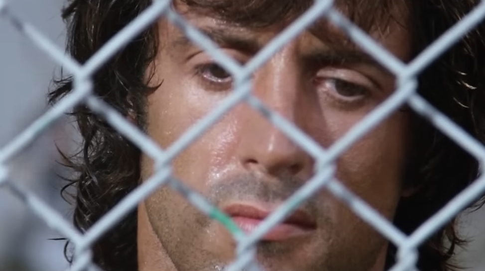
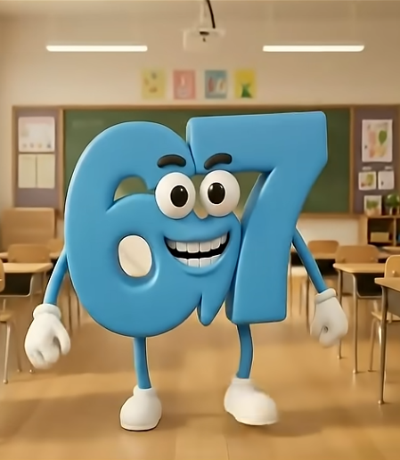

En la mona de este año, al DCC le faltaban representantes en tetris. Como lo comenté en algún post (no recuerdo cuál), tenía baneada la IP de tetr.io y del tetris clásico por problemas de adicción. Tal como al inicio de Rambo II, cuando el Coronel Samuel Trautman va a buscar a Rambo a la cárcel para una misión de la más alta complejidad, el Jero fue a buscarme para dar cara por el DCC.

Rambo preso en la 2, él por su habilidad para matar, yo por mi destreza con el DT Cannon

## La misión

Ganar tetris. Nivel de dificultad: imposible, y es que ni siquiera era el mejor del DCC ya que el Blaz también participó y él es SS. Como no tenía cuenta para jugar ranked (ya que no jugaba competitivo hace años, y en la cuenta anterior hice la solicitud de que me banearan para no jugar más) tuve que crearme una cuenta desde 0 y levelearla. Por suerte con el pasar de los años no perdí el toque y llegué rápidamente a S+, pero ahí me quedé.

## Resultado

Los mejores 6 pasaban a la final que era transmitida por Twitch. Por suerte el camino a esto estaba medio que regalado. En la competencia había un U, 2 SS, 2 S+ y luego el salto era hasta A. La diferencia de nivel entre el 5 y el 6 era sustancial, y como había losers bracket, pude llegar cómodamente al día final de competencia.

## Caída desde winners

En algún punto en winners me topé con el Rajón (el otro S+). No digo que le habría ganado, pero nos enfrentamos el mismo día que volví a las ranked, por lo que estaba sin ritmo de juego, lo que creo me costó bastante caro. Siento que le pude haber ganado, pero el loco es bueno, nada que decir, perdí bien.

## El resto de partidas

Creo que las gané todas 5-0, no hay mucho que comentar. Como dije, entre el 5 y 6 lugar había un mar de diferencia.

## Gran final

En mi primera partida me pillé al TheFifo. El weón es SS y realmente pensé que me iba a hacer mierda. Nada hacía presagiar que la partida estaría pitiadamente pareja, en algún momento empaté la llave 6-6 y todo se decidiría en un épico game 13 (eran al mejor de 13). El Six Seven era inevitable.

El monito de sixseven

A pesar de que fue de mis mejores partidas, perdí igual xd. El loco era simplemente mejor que yo, y si él no la cagaba, no tenía forma de perder, pero weno, se intentó.

## Consecuencias

Volví a la droga y dejé de publicar por CASI UN MES. Na que ver. Pero he vuelto, y volví a bloquear la IP de tetr.io, no sin antes sacar unos jugosos 10 PC que agregar a los registros del blog. Volveré al modo zen, espero dure como mínimo un par de semanas, como para que salga alguna cosa bacana digo yo.
