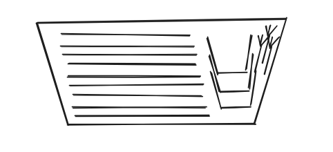

A diferencia de las tazas ([ver post sobre las tazas](/blog/2026/01/09/sobre-las-tazas)), la mayoría de los platos en los hogares de Chile cumplen con uno de los principales principios del orden según el salismo: son apilables. Aún así, para alcanzar un nivel de optimización superior, como en la mayoría de las cosas, es necesario empezar el diseño desde cero, considerando tanto los costos de producción (que son los que siempre se toman en cuenta) como los costos de mantenimiento, que en el caso de los platos son INFINITAMENTE más altos.

## ¿Cuánto cuesta un plato?

Como lo he explicado en múltiples ocasiones, el costo verdadero de las cosas es la suma del costo de adquisición más el costo de mantención. En el caso del plato, de entre todas las cosas que se necesitan para mantener uno, la que destaca por su alto precio es la parte de lavarlos.

## Lavar los platos

En lo personal, lavo la loza frecuentemente en mi casa. No sufro tanto haciéndolo, pero es algo que definitivamente preferiría no hacer. Se vuelve más problemático aún en invierno, cuando lavar algo tan mínimo como una cuchara implica cagarse de frío las manos, y así.

Es fácil comprobar que no soy la única persona que preferiría no hacerlo, y es que si a nadie le importara, no aparecería en el catálogo del Lider lo que promete ser la solución a este problema: el lavavajillas.

## El lavavajillas

No es tan común tener uno. Pero de las pocas reviews que he recopilado, pareciera ser claro que apañan bastante para lavar la loza, pero que su mantenimiento tampoco es tan fácil, ocupan un espacio no menor, y ante casos de limpieza difícil (como platos muy grasosos) no terminan de ser suficientes.

## El problema

Es el diseño de una solución general para un problema que podría perfectamente no serlo. A pesar de no tener evidencia de que un lavavajillas especializado en diseños estandarizados y específicos de platos, vasos, etc. obtendría resultados sustancialmente mejores que los lavavajillas actuales (que es algo que creo firmemente en todo caso), es imposible no convencerse de que, como mínimo, tendría un rendimiento igual o mejor que lo que tenemos actualmente.

## Cómo implementar

En mi mundo ideal, generalizar los tamaños estandarizados sería lo mejor. Pero teniendo en cuenta lo imposible que sería hacerlo, me imagino paquetes de lavavajillas + platos/cubiertos/vasos/etc. Una idea que se me ocurrió y que no tengo cómo sustentar es la de en una caja cerrada, se puedan meter las cosas y que calcen de forma exacta o casi exacta, y con eso las dejas reposando inundadas en algún químico chernobyliano que saque la grasa y luego se enjuaga en la misma wea y queda impecable.

## Idea vapuleada

Masacraron mi idea en el cdi, malditos, les enseñaré, les enseñaré a tooooodooooos.
