Desde hace un tiempo, sobre la ruta habitual entre mi casa y la universidad, me percaté de la existencia de lugares muy puntuales donde el Bluetooth de mis audífonos comenzaba a fallar. ¿Por qué? Sería mi nueva misión descubrir quién estaba detrás de esto.

El primer paso fue identificar los 3 principales lugares donde el descarado ataque a mis dispositivos electrónicos fue perpetrado: cruzando Santa Elena para llegar al metro Rodrigo de Araya, cruzando avenida Matta para tomar el metro Irarrázaval y cruzando Blanco Encalada para llegar a la U.

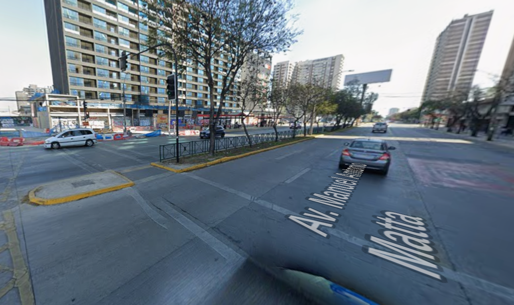
  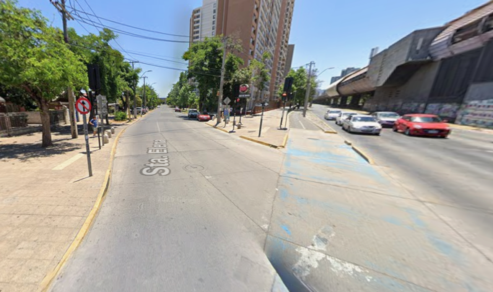
  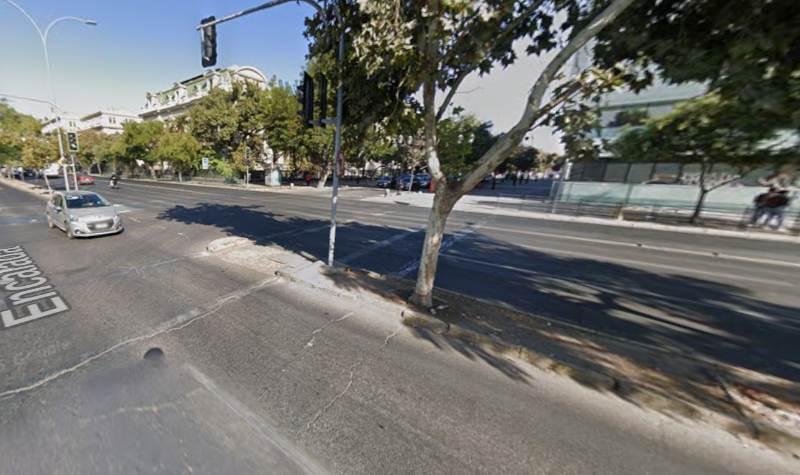

Lugares del ataque: Metro Irarrázaval, Metro Rodrigo de Araya y Blanco Encalada.

## El objetivo

Encontrar patrones en cada uno de los 3 lugares para identificar el origen de estos ciberataques, y poder así preparar un plan de contraataque para hacerle frente a estas fuerzas del mal.

## Fuente confiable

O ESO CREÍA YO. Resulta que tanto el cruce en metro Rodrigo de Araya como el de Blanco Encalada para llegar a la U tienen una fuente cerca. En el caso de Rodrigo, la Fuente Mardoqueo, y en el de Blanco, una fuente de agua. Las que pensé eran fuentes cercanas resultaron ser fuentes serviles a Satanás, ¡pero yo soy más astuto! Pronto prepararé el plan para neutralizar este activo del enemigo.

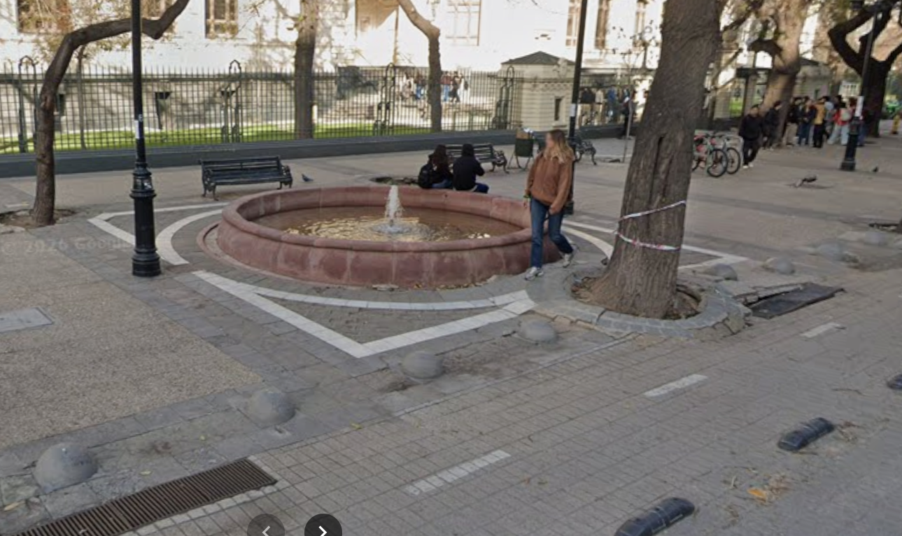
  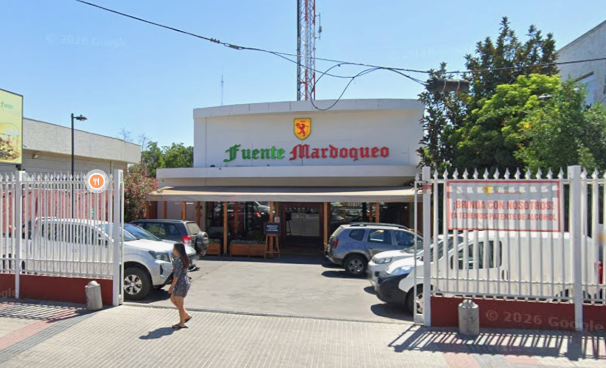

Las fuentes de la traición.

## Gigantografía eléctrica

Algo no calzaba, el enemigo necesitaría una base de operaciones electrónicas para operar con tal precisión sobre mi campo magnético. ¡Ciego me sentí al percatarme de que siempre estuvo frente a mis ojos! Tanto el cruce de Irarrázaval como el de Rodrigo tienen gigantografías digitales listas para interceptar las señales que me permiten escuchar los clásicos románticos de ayer y hoy, pero la amenaza fue identificada, y pronto pasará a ser no más que escombros.

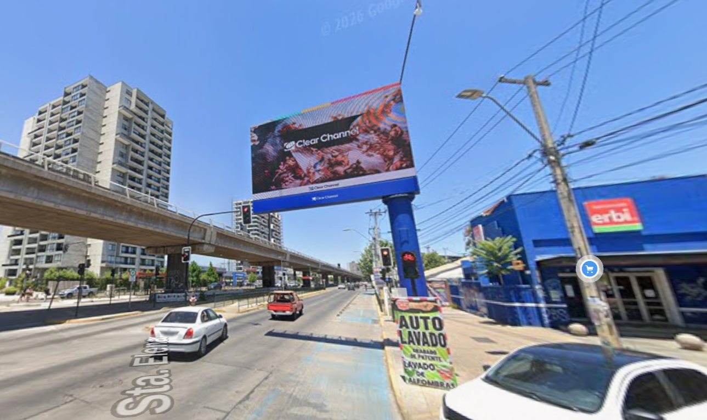
  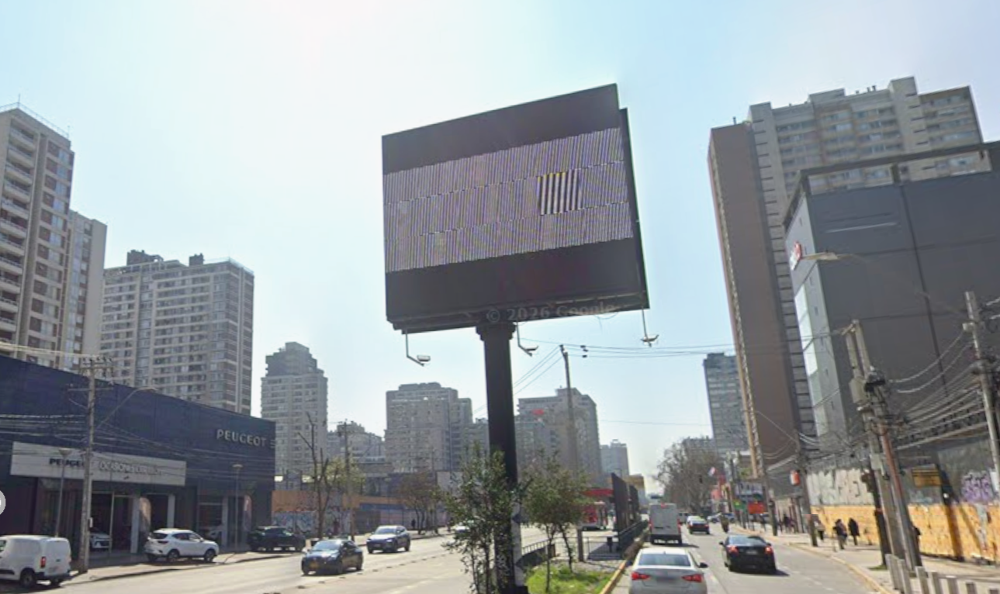

Las antenas de intercepción digital del enemigo.

## Financiamiento

Aun así, algo no calzaba. Tal equipo tecnológico requeriría financiamiento, y luego de trazar y seguir el rastro del dinero, se hizo evidente. Tanto en Rodrigo como en Blanco estas células antisalistas se financian a partir de impresiones, en algunos casos, ¡incluso en tres dimensiones! ¡Qué audacia!

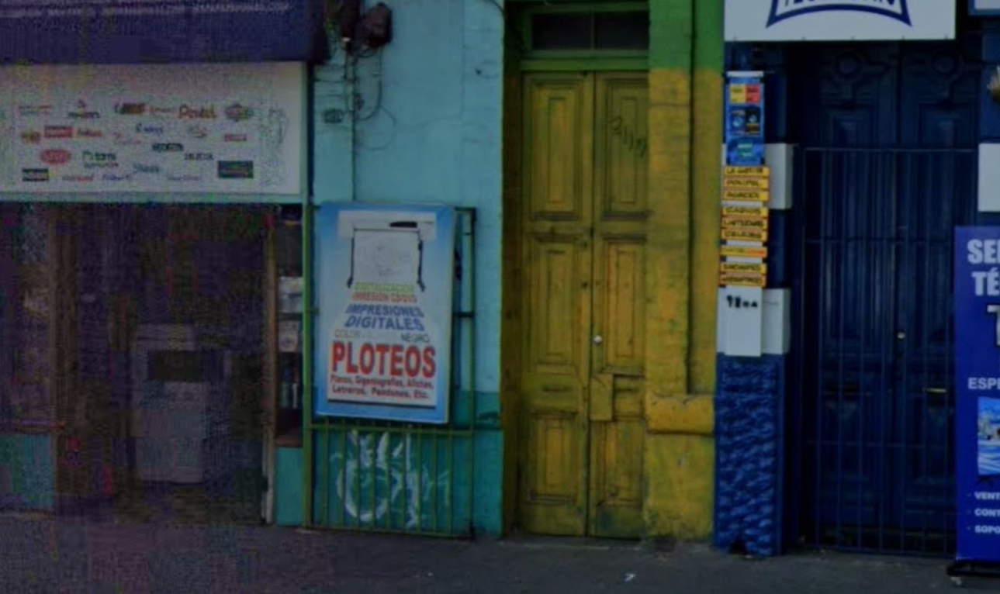
  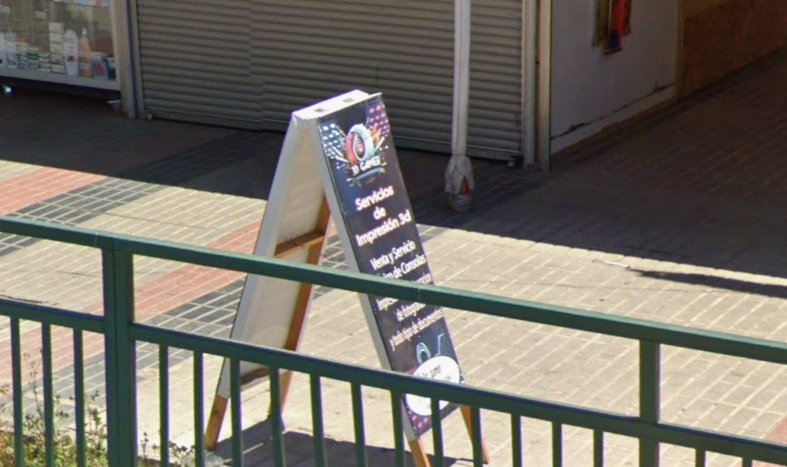

El oscuro negocio de las impresiones para financiar al enemigo.

## Quién

Tan solo faltaba descubrir al antagonista de esta historia. Estaba desesperado, parecía que no habían dejado rastro en ninguna de sus maniobras, hasta que en el último de los informes de inteligencia todo hizo sentido.

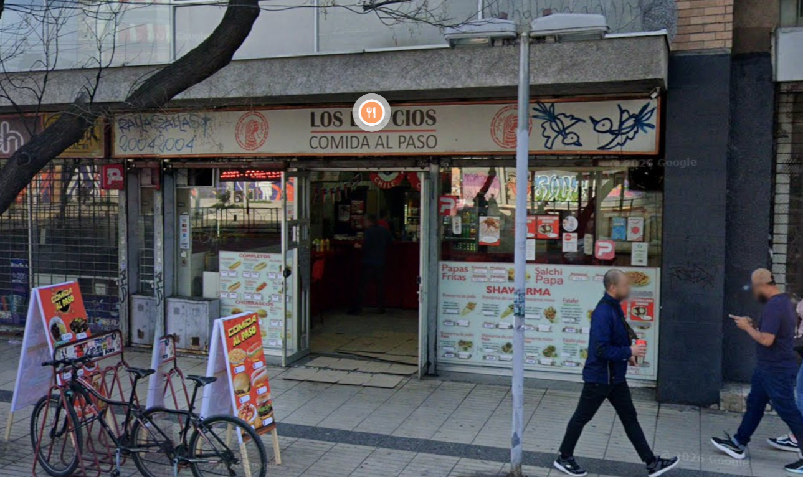
  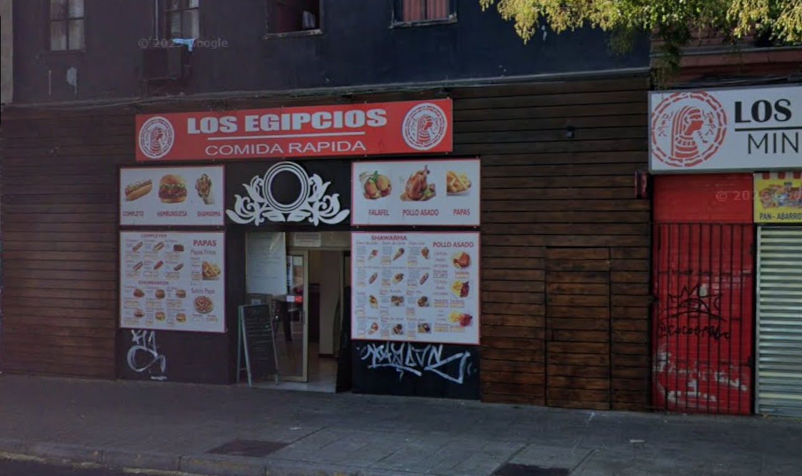

La pista definitiva: los egipcios operando en las sombras.

## Los egipcios

Era que no, mis archienemigos desde aquel día que intenté devolver unas papas que quedaron muy saladas. Había pasado mucho tiempo desde la última operación de la que me enteré y que conspiraba contra mi persona. Por un momento pensé que se habían desbandado, y cuando más baja tuve la guardia, pam, me dan un golpe del que recuperarse será muy difícil. Interrumpir mi música en el coro de "Paisaje" de Franco Simone significó una pérdida de billones para la cúpula del estado salista. Los egipcios y sus secuaces lo volvieron a hacer, pero esto no quedará así.

## La nave nodriza

Gracias a estos nuevos descubrimientos, y luego de correr algoritmos de búsqueda intensiva en supercomputadoras de billones de dólares, logré dar con el cuartel general de este grupo insurgente. ¡Y es que se esconden ni más ni menos que en la embajada egipcia!

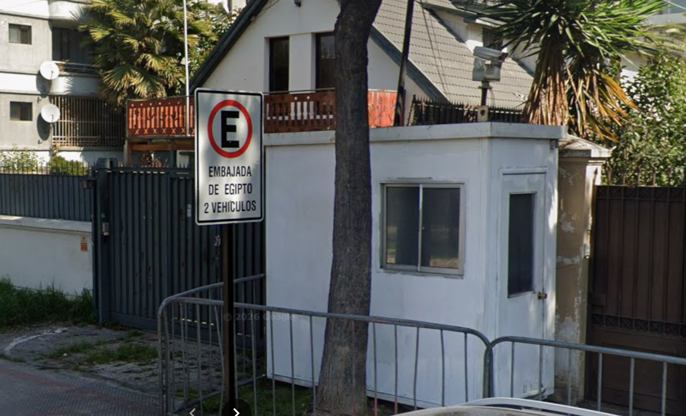

La mismísima Embajada Egipcia.

Al inicio no lo quise creer. Siempre tuve buena relación con el estado egipcio, no por nada era mi main en el Civilization V, hasta que la pista con la que confirmé la traición salió a la luz. Quedé desolado, y es que a solo unos pocos pasos de la embajada se encontraba ni más ni menos que:

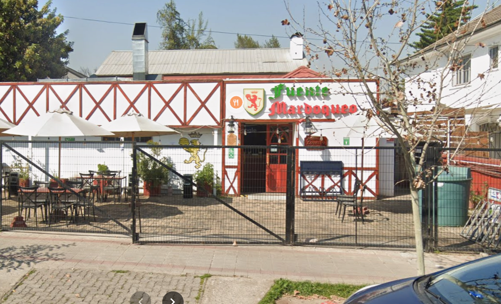

Ni Judas se atrevió a tanto: una Fuente Mardoqueo al lado de la embajada.

## El plan

Para lograr acabar con esa artimaña lo primero será tomarme las pastillas. Luego, me autocomplaceré para lograr pensar con mayor claridad. Y finalmente, lobotomizaré mis pensamientos consumiendo el opio del pueblo: un partido del mundial (Alemania vs Paraguay).

## En la polla

Partidazo. Puse que ganaba Alemania 3 - 1. Necesito estos puntos para seguir soñando. Deséenme suerte.
