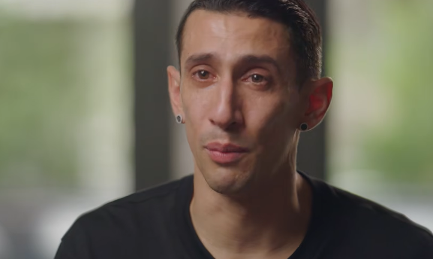

Tengo miles de trofeos, pero como este no, como este no hay.

Por cuarta vez consecutiva, Anakena gana la Mona, y aunque me sigue llenando de orgullo, este año nos sacamos una espinita que picaba desde hace dos años: una espinita del tamaño de un zapato que, si no nos la sacábamos este año, era de imaginarse que no nos la sacaríamos nunca.

## Fútbol en Beauchef

Del fútbol ya se ha hablado mucho. Y creo que en mi [post](/blog/2026/02/05/el-futbol/) sobre ello quedó todo más que claro. Me encanta el fútbol, y no parece ser un gusto rebuscado, ya que en Chile y en el mundo es el deporte (y, me atrevería a decir, espectáculo) más mediático e importante que hay.

El fútbol me apasiona, pero el baby fútbol en la facultad me vuelve loco. En mis años universitarios de mayor vagancia no había partido que me perdiera con mis amigos. Helada en mano, nos disponíamos a ver hasta los encuentros más rebuscados de la copa cdi, premier dii, geoliga, pichanga culia penca, lo que sea. Y es que las emociones del fútbol en una comunidad no tienen comparación: la pasión, el sentimiento, las peleas, los gritos, estar ahí, en la ebria (que debe ser la mejor ubicación que se le puede ocurrir a cualquiera para ver un partido de fútbol) se vive todo. Es hermoso. Te inspira. En mi caso, al menos, más que cualquier composición, que cualquier pintura, es caviar para el espíritu.

## Poesía para el alma

Ctm, mientras escribía, casi se me caen las lágrimas, puta que me ha dado alegrías el baby fútbol en el coliseo de 850, es algo que por siempre guardará un lugar en mi corazón.

Tan así que me animé a redactar un poema:

### Oda al Baby Fútbol en 850

Mi reino por un caballo!  
Y mil caballos por el bloque del almuerzo!  
Y si la adefa así lo quiere  
Pactado está el encuentro  

Papelito en mano me agarró a chuchadas  
La civiliga me ocupó la cancha  
Mi papel culiao les vale garcha  
Y la adefa me cagó de nuevo  

Si no se juega ahora, se juega en año nuevo  
La feria del libro empieza en la tarde  
Y entre premier dii y la dccerie  
Domingo a las 3 am es lo que queda para pedir  
Pero no me quiero ir  

Conseguirte es un calvario  
Conquistarte una proeza  
Ganar es para pocos  
Soñar para cualquiera  

Llueva o truene no me importa  
Ahí estaré para vivir  
Lo que muchos se han perdido  
Donde sobran sentimientos  

No siempre me voy contento  
A veces derrotado  
El sueño es lo que me mueve  
Lo que me anima a levantarme  

Dos años nos quedamos  
Con el grito en la garganta  
En ambos fue el mismo villano  
Pero de eso nada más  

Al negro y verde  
Hoy le toca celebrar  
Y aunque para algunos de nosotros  
Es la portada  
Para la historia del coliseo  
Es solo un ladrillo más  

Rascacielos de un solo piso  
Océano en un vaso  
Diez se sienten cien  
Y cien, cien mil  

El coliseo ruge  
El árbitro mechón no cobra mal sacado  
Sobrepeso diagnostican al árbitro  
Alopecia en los peores casos  
Y desde la ebria acusan infidelidad  

No queda más que beber las penas  
En su defecto, las alegrías  
Pero rapidito, vayamos desocupando la cancha  
Que el coloso está listo  
Para dibujar su nuevo cuadro  
Componer su siguiente rapsodia  
Otras serán las retratadas  
Otros las figuras literarias  

Cosas cambian  
Cosas quedan  
La pasión y el sentimiento no se toca  
Y el día que la pasión muera  
Espero morir con ella  

## El camino

### 2022

Nos eliminó Industrias en cuartos. No era un mal equipo, le faltaba madurar.

### 2023

Nos eliminó Geo, en cuartos nuevamente. No se practicaron los penales, una lástima.

### 2024

Equipazo. Final contra Civil. Tocó sopa.

### 2025

Equipazo. Final contra Civil. Otra vez sopa.

### 2026

8 - 7 terminó el partido. Está [grabado](https://www.youtube.com/watch?v=yVyzfv4hLZc). La gente se ríe cuando escucha que por un partido en la facultad me cuesta dormir, pero así ha sido los últimos 4 años, esta no sería la excepción.

Equipazo. Veníamos de una cómoda semi contra Industrias. Campaña perfecta. Todos los partidos ganados. Para la final se nos cayeron nombres muy importantes y se me metió un poco en la cabeza: el Alonso (quizá el máximo ídolo en la historia del equipo) se desgarro, y al Lorca lo raptaron los aliens.

Eso sí, este año teníamos superestrella. Nos la trajimos con petrodólares. Algo que me da un poco de plancha. Pero, como dirían en el Shogun 2, victory wipes away dishonour. Al arco un futuro ídolo. Y rendimientos individuales inesperados en la final.

8 - 7 weon.

Geo se nos vino encima en los últimos minutos. Tuvo 2 para empatarlo.

El pelao culiao dió como 9 minutos de descuento. No quería terminar el partido.

8 - 7.

Sobre el partido, nada. Se alinearon los astros. A todos nos tiene que tocar en algún momento. Todos merecen sonreír.

Gracias multicancha de 850. Gracias coliseo.

Gracias.
